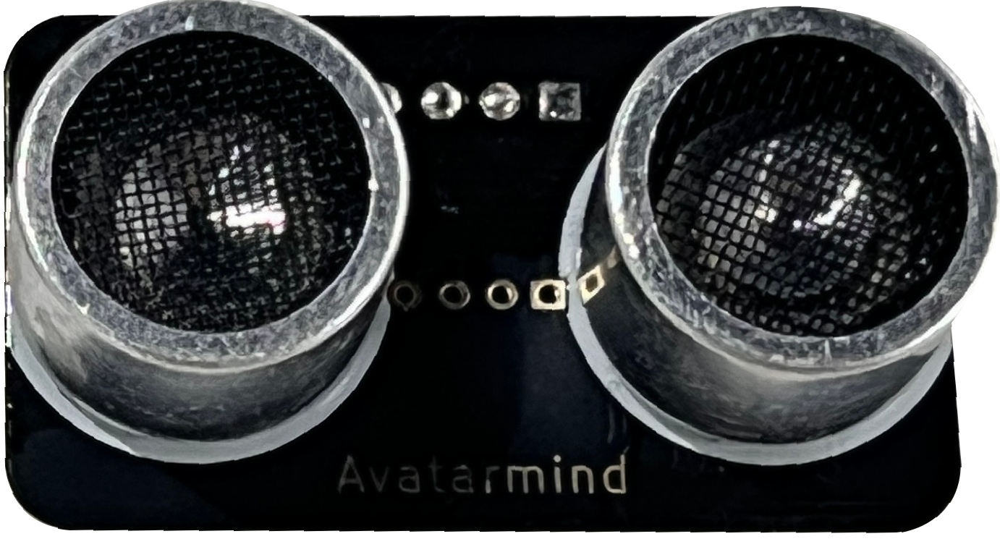

# 超声波模块

## 模块介绍

Avatarmind超声波模块是一款超声波测距模块。特别应用于玩具超声测距，机器人等应用。

采用自研超声波测距解调芯片，单总线，外围更加简洁，芯片内置高精度振荡器，无需额外晶振。驱动采用扫频技术，减少探头本身一致性对模块灵敏度的影响。

## 模块参数

- 工作电压：4.5V~5.5V
- 功耗电流：15mA
- 探测距离范围：2cm～4米
- 通讯引脚：G/V/Trig/Echo
- 接口：磁吸接口、PH2.0接口

## 模块原理介绍

### 超声波部分测量操作

 外部 MCU 初始设置为输出，给模块 I/O 脚一个大于 10uS 的高电平脉冲；输出脉冲信号后，MCU 设置 为输入模式，等待模块给出的一个与距离等比的高电平脉冲信号；测量结束后 MCU 设置为输出模式，进行下次测量。声速可根据脉宽时间“T”算出：

距离=T(从发送信号至接收到信号的时间)*340/2 ( 340m/s是声音在空气中的传播速度)

